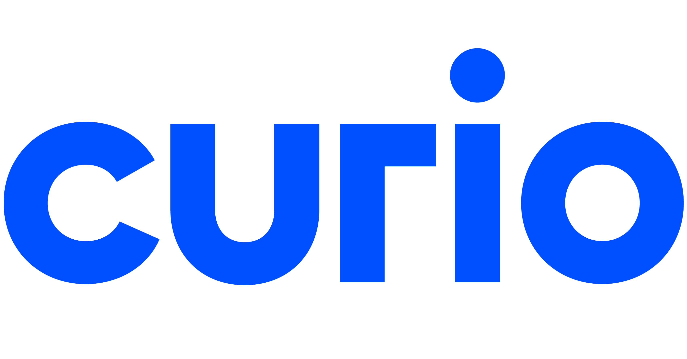

# Curio Project Readme

Het Curio-project is een website met informatie over de opleiding tot software developer. De site biedt inzicht in de opleidingsinhoud, docenten, het rooster en de benodigde middelen
## Waarom het project nuttig is
Dit project helpt toekomstige studenten de opleiding tot software developer beter te begrijpen. Het geeft informatie over vakken, docenten en wat je nodig hebt, zodat je een goede studiekeuze kunt maken.
## Hoe gebruikers aan de slag kunnen met het project
Om te beginnen met het Curio-project, volg je deze stappen:

Kloon de repository: Gebruik een Git-client om de repository van het project te klonen naar je lokale computer.

Open een webserver: Start een lokale webserver, zoals Laragon of een vergelijkbare applicatie, om de website lokaal te hosten.

Navigeer naar de website: Open een webbrowser en ga naar de lokale URL waarop de website wordt gehost (bijvoorbeeld http://localhost).

---

